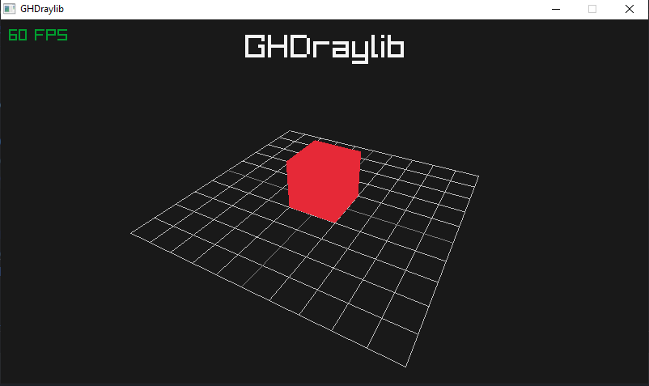

# GHDraylib

A very simple raylib example project using CMake.

## Features

- Camera
- 2D drawing (Text)
- 3D drawing (Cube, Grid)
- FPS counter

## How to use

clone this repo and open it using your CMake enabled IDE/editor!

CMakeLists.txt is mostly taken from [raylib-game-template](https://github.com/raysan5/raylib-game-template/blob/main/CMakeLists.txt)