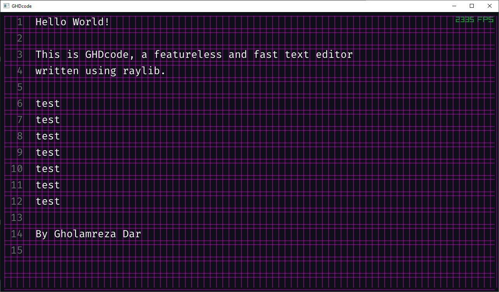
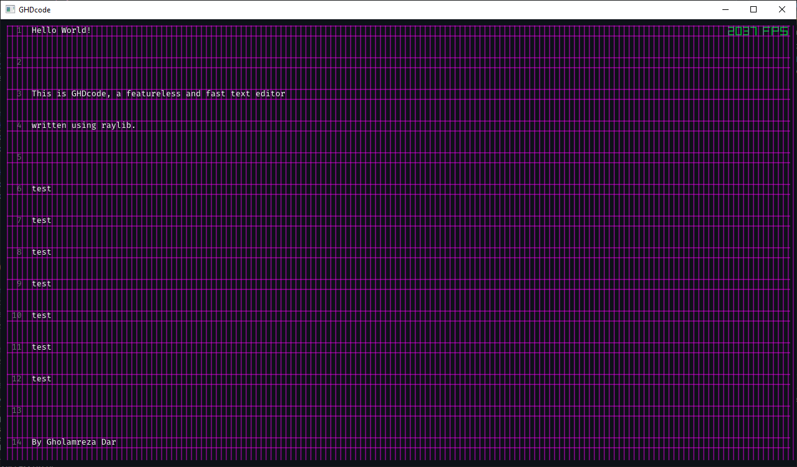
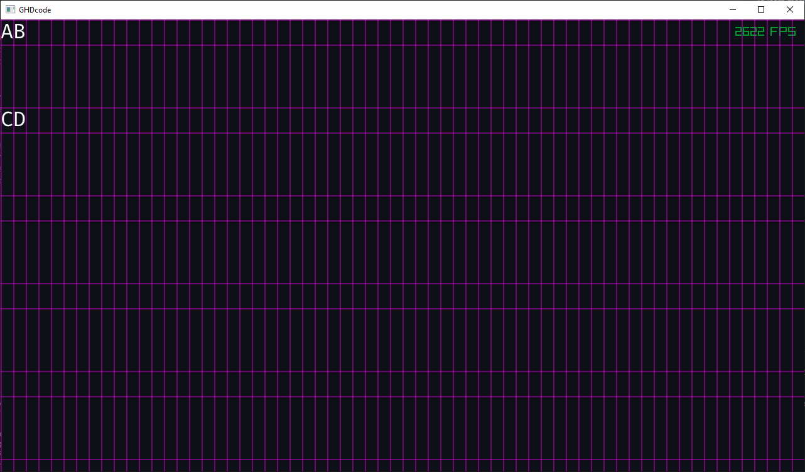
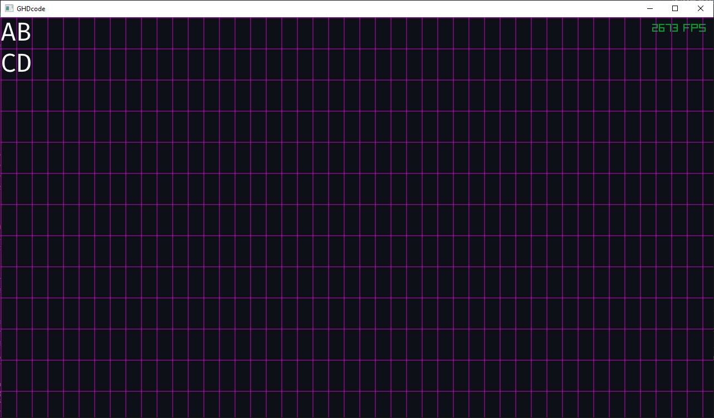

# GHDcode

This is a featureless but very fast text editor written in C++ using raylib.
I wanted to understand how text editors work under the hood.


## Features

- Display basic text
- Line numbers
- Zoom in and out
- Change vertical line spacing

## How to use

- Use `Ctrl + Q` to zoom out and `Ctrl + E` to zoom in
- Use `Shift + Q` to decrease the vertical spacing and `Shift + E` to increase the vertical spacing
- Use `Ctrl + G` to toggle the debug grid

## Demos

- Right Now!
    
- Added Shortcuts for changing line spacing
    
- Added Line numbers and Text + padding
    
- Add vertical line spacing 
    
- Main character grid 
    

## Build

Build using CMake.

```sh
cmake -B build -S .
cmake --build build --config Debug
```
