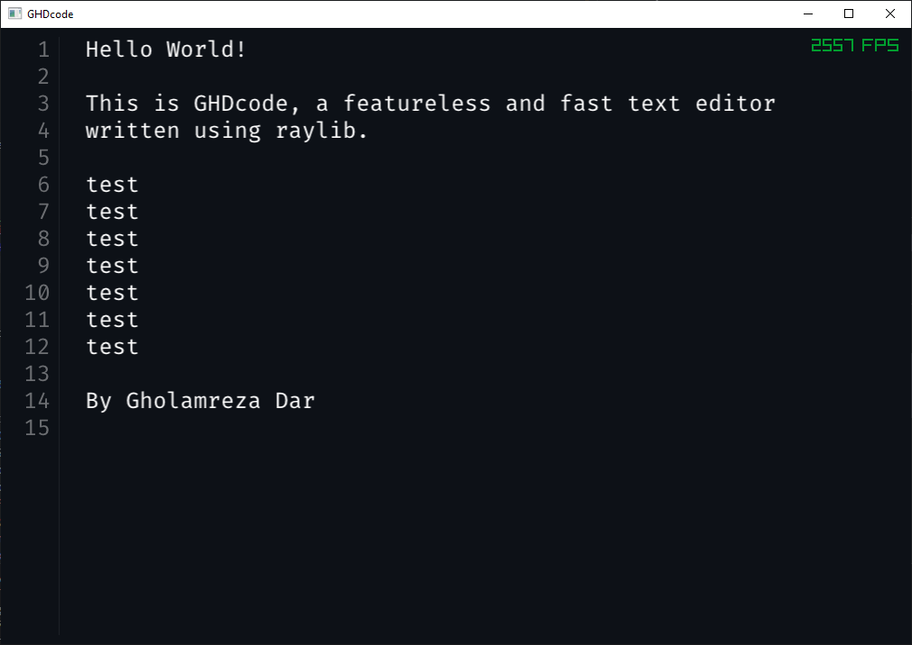

# GHDcode

This is a featureless but very fast text editor written in C++ using raylib.
I wanted to understand how text editors work under the hood.



## Features

- Line numbers
- Display basic text
- Zoom in and out

## How to use

- Use `Ctrl + Q` to zoom out and `Ctrl + E` to zoom in

## Build

Build using CMake.

```sh
cmake -B build -S .
cmake --build build --config Debug
```
